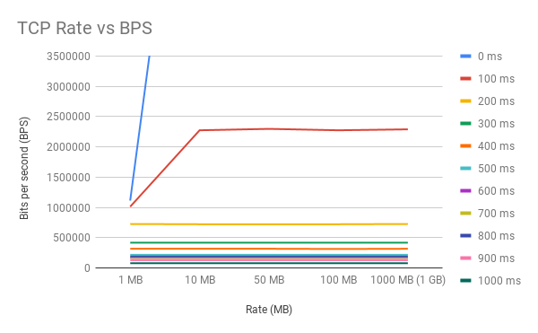
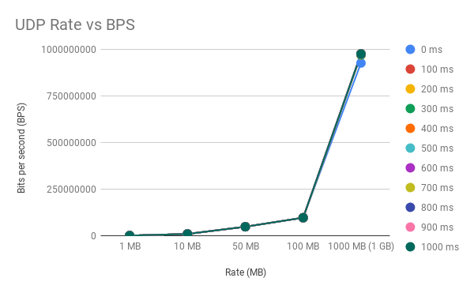

# TCGUI

A lightweight Python-based Web-GUI for Linux traffic control (`tc`) to set, view and delete traffic shaping rules. The Web-GUI is intended for short-term isolated testbeds or classroom scenarios and does not contain any security mechanisms.

No further changes are planned right now, but pull requests are welcome.

## Requirements

- Ubuntu 16.04 LTS
- `sudo apt-get install iperf3`
- `sudo apt-get install gspread`

## Overview
The purpose of this program is to show traffic control (TC) data between different computers, ROSnodes, and configurations.


- The image above shows overview information of connections from office_pc to xcy_mini_pc connected to same router.
- The table layout has rate as table headers, while first column is delay data from 0 to 1000ms with Transmission Control Protocol (TCP) data on left and User Datagram Protocol (UDP).
- For set data not in those columns/rows, custom rate and delay can be used.


## Usage
- The google spreadsheet can be accessed [here](https://docs.google.com/spreadsheets/d/1T6ayTn8KCTebblzwLHIkHSnBUha2vw7puMHLEvrwTLE/edit#gid=555898294).
- First, setup another computer with iperf and alter lines 52 and 74 with that computer's IP in gheet.py.
- Have two terminals running, one with the server side computer running TCGUI and the other running just this command:
```
$ iperf3 -s
```
- To populate the spreadsheet and do tests, run commands from command line where # is variable number in this format:
```
/tcgui $ python gsheet.py --Name Rate --Value #MB --Delay #ms 
```
- Some examples:
  - For testing one value in TCP and UDP with 1MB rate and 0ms delay. This will show up in corresponding cell in table.
```
/tcgui $ python gsheet.py --Name Rate --Value 1MB --Delay 0ms 
```
  - For testing a custom rate value in TCP and UDP with custom delay not in table already (15MB rate, 250ms delay). This will show up in H20 cell.
```
/tcgui $ python gsheet.py --Name Rate --Value 15MB --Delay 250ms 
```
  - For testing multiple rate values (for example, write NA) in TCP and UDP with 500ms delay. This will show up for that row with given delay. This also applies to custom delays.
```
/tcgui $ python gsheet.py --Name Rate --Value NA --Delay 500ms 
```


## Summary of test data
- From XCY Mini PC to Office Computer using same router, two sets of data were collected. The results show comparison between Transmission Control Protocol (TCP) and User Datagram Protocol (UDP) with two different graphs. 
- The graph data shows rate values from 1 megabyte (MB), 10 MB, 50 MB, 100 MB, and to 1000 MB (1 GB) as the X values and bits per second values as the Y values. Each line corresponds to delay values ranging from 0 milliseconds (ms) to 1000 ms in increments of 100 ms. 
- The TCP graph below shows trends the different delay colored values when the delay is higher, less BPS data is transmitted as expected. 0ms and 100 ms delay were quite large in BPS transmission, however, 200 ms and higher delay, under 1,000,000 BPS were transmitted. The possible reason for these differences that sending a sync (syn), syn acknowledge (ack), ack with a larger delay dramatically reducing the BPS since lots of wait time incurs.



- The UDP graph below shows trends the different delay colored values when the delay is higher, the BPS seems unaffected. The biggest effects are the rate condition, the higher it is set, the more BPS is sent. Implementing a delay may have no effect since there isn't much of a requirement for syn and ack unlike it is for TCP data transfer, so data can be sent more freely with UDP.



## Future Work
- More tests planned for different computer configurations.

## References
- [Traffic Control GUI](https://github.com/tum-lkn/tcgui)
- [Build router with Ubuntu](https://www.ascinc.com/blog/linux/how-to-build-a-simple-router-with-ubuntu-server-18-04-1-lts-bionic-beaver/)